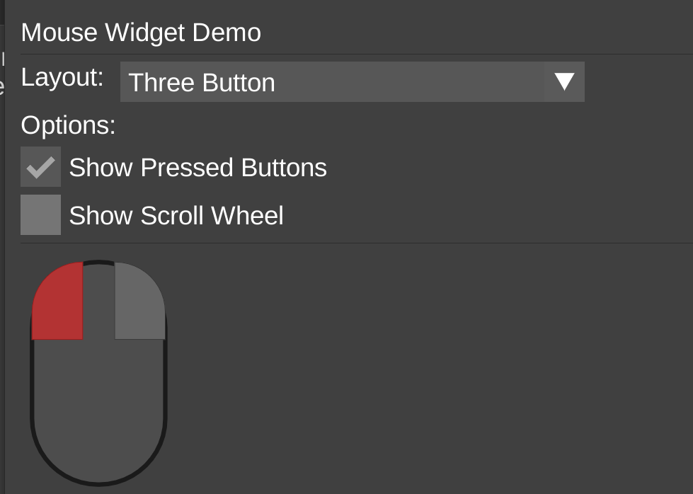
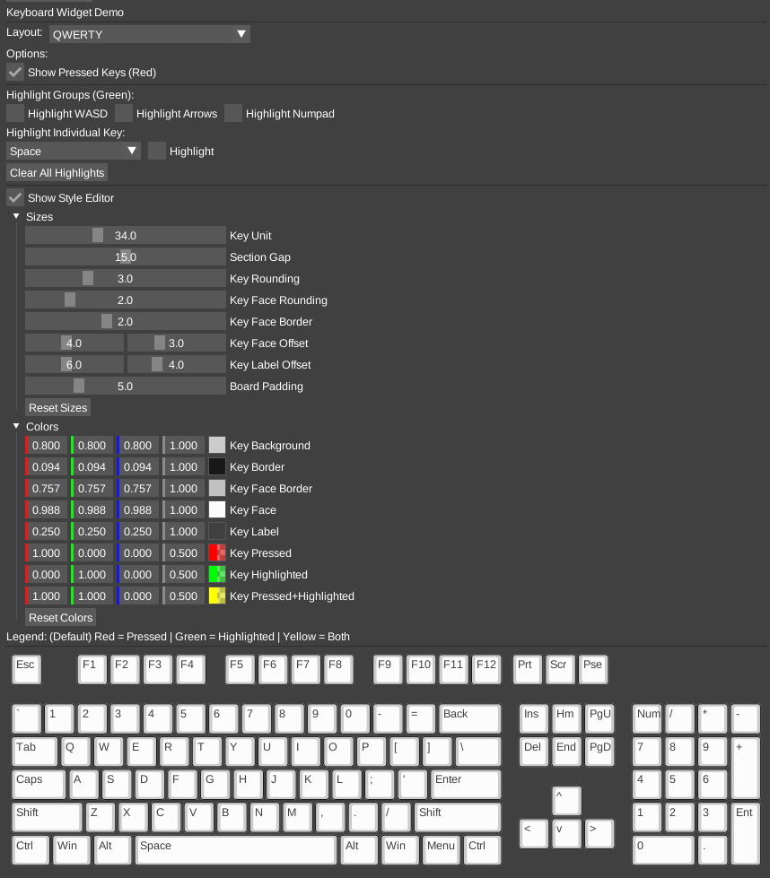

# imgui_keyboard

A virtual keyboard widget for [Dear ImGui](https://github.com/ocornut/imgui).







## Features

- Multiple keyboard layouts: QWERTY, QWERTZ, AZERTY, Colemak, Dvorak, Numeric Pad
- Auto-detect layout based on system settings
- Key highlighting and press visualization
- Fully customizable styling (colors, sizes, rounding)

## Usage

```cpp
#include "imgui_keyboard.h"

// Render the keyboard
ImKeyboard::Keyboard(ImGuiKeyboardLayout_Qwerty, ImGuiKeyboardFlags_None);

// Highlight specific keys
ImKeyboard::Highlight(ImGuiKey_W, true);
ImKeyboard::ClearHighlights();
```

## Integration

Add `imgui_keyboard.cpp` and `imgui_keyboard.h` to your project.

## License

MIT License - see [LICENSE](LICENSE) for details.
